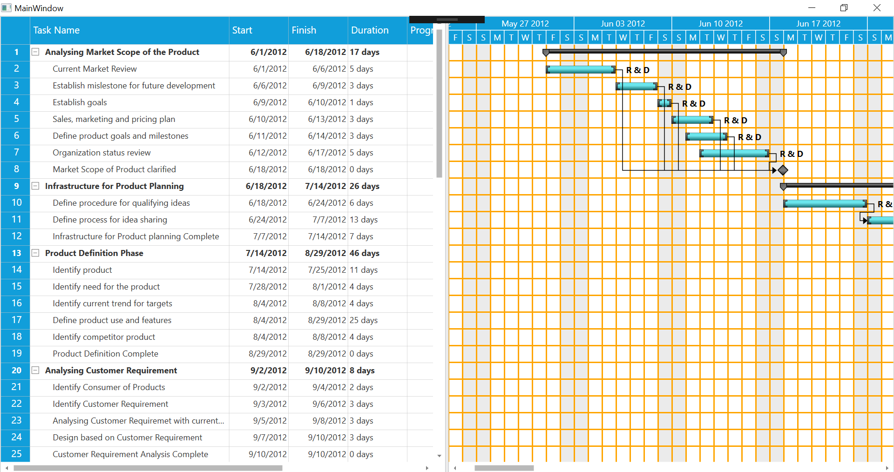

# How-to-show-horizontal-and-vertical-grid-lines-in-WPF-Gantt-control

This article explains how to show horizontal and vertical grid lines in Syncfusion WPF Gantt control, as shown in below.

 

## Display the horizontal grid lines

To show the horizontal grid lines, set the value for BorderThickness and BorderBrush property in GanttCharRow using style as shown in the below.

[XAML]

```
            <sync:GanttControl.Resources>
                <Style TargetType="chart:GanttChartRow">
                    <Setter Property="BorderThickness" Value="0,0,0,2"/>
                    <Setter Property="BorderBrush" Value="Orange"/>
                </Style>
            </sync:GanttControl.Resources>
```

## Display the vertical grid lines

To show the vertical grid lines in Gantt control by using the strip lines in the Gantt chart as shown in the below.

[XAML]

```
        <sync:GanttControl x:Name="Gantt"
                               ItemsSource="{Binding TaskCollection}"
                               ResourceCollection="{Binding ResourceCollection}"
                               ShowStripLines="True" Loaded="Gantt_Loaded"
                               StripLines="{Binding StripCollection,
    
                                                         Mode=TwoWay,
                                                    UpdateSourceTrigger=PropertyChanged}"
                               VisualStyle="Metro">

          …

            <sync:GanttControl.TaskAttributeMapping>
                <sync:TaskAttributeMapping TaskIdMapping="TaskId"
                                               TaskNameMapping="TaskName"
                                               StartDateMapping="StartDate"
                                               FinishDateMapping="FinishDate"
                                               ChildMapping="Child"
                                               DurationMapping="Duration"
                                               ProgressMapping="Progress"
                                               PredecessorMapping="Predecessor"
                                               ResourceInfoMapping="Resources"/>
            </sync:GanttControl.TaskAttributeMapping>
        </sync:GanttControl>
```

[C#]

MainWindow.xaml.cs

```
        private void Gantt_Loaded(object sender, RoutedEventArgs e)
        {
            Border border = VisualTreeHelper.GetChild(Gantt, 0) as Border;
            Grid grid = VisualTreeHelper.GetChild(border, 0) as Grid;
            ScrollViewer scrollViewer = VisualTreeHelper.GetChild(grid, 2) as ScrollViewer;
            Grid scrollGrid = scrollViewer.Content as Grid;
            ganttChart = VisualTreeHelper.GetChild(scrollGrid, 1) as GanttChart;
            ganttSchedule = VisualTreeHelper.GetChild(scrollGrid, 0) as GanttSchedule;

            List<StripLineInfo> stripCollection = new List<StripLineInfo>();
            var differenceTime = (this.ganttSchedule.EndTime - this.ganttSchedule.StartTime).Days;
            for (int i = 0; i < differenceTime; i++)
            {


                stripCollection.Add(new StripLineInfo()
                {
                    Type = StriplineType.Absolute,
                    Width = 2,
                    Height = this.ganttChart.ActualHeight,
                    Position = new Point(PositionCalculation(this.ganttSchedule.StartTime.AddDays(i)), 0),
                    HorizontalContentAlignment = HorizontalAlignment.Center,
                    VerticalContentAlignment = VerticalAlignment.Center,
                    Background = new SolidColorBrush(Colors.Orange),
                });
            }
            model.StripCollection = stripCollection;
        }

        private double PositionCalculation(DateTime day)
        {
            DateTime date = ganttSchedule.StartTime;
            MethodInfo methodInfo = typeof(GanttChart).GetMethod(
    "GetStartPositionOfDate",
    BindingFlags.Instance | BindingFlags.NonPublic | BindingFlags.Static,
    null,
    new Type[] { typeof(DateTime) },
    null);
            object[] dateObjects = new object[] { day };
            double extent =
                (double)
                methodInfo.Invoke(
                    this.ganttChart,
                    BindingFlags.Instance | BindingFlags.NonPublic,
                    null,
                    dateObjects,
                    CultureInfo.CurrentCulture);
            return extent;
        }
```

## See also

[To add custom tooltip to gantt](https://help.syncfusion.com/wpf/gantt/customtooltip)

[To define your own schedule for Gantt to track the progress of projects](https://help.syncfusion.com/wpf/gantt/custom-schedule)

[To differentiate the dates of holidays](https://help.syncfusion.com/wpf/gantt/holidays-customization)


